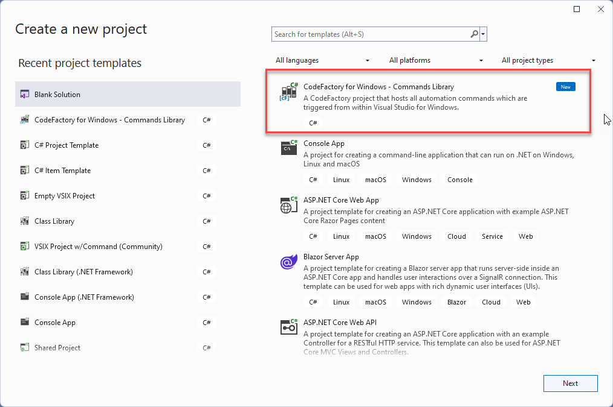
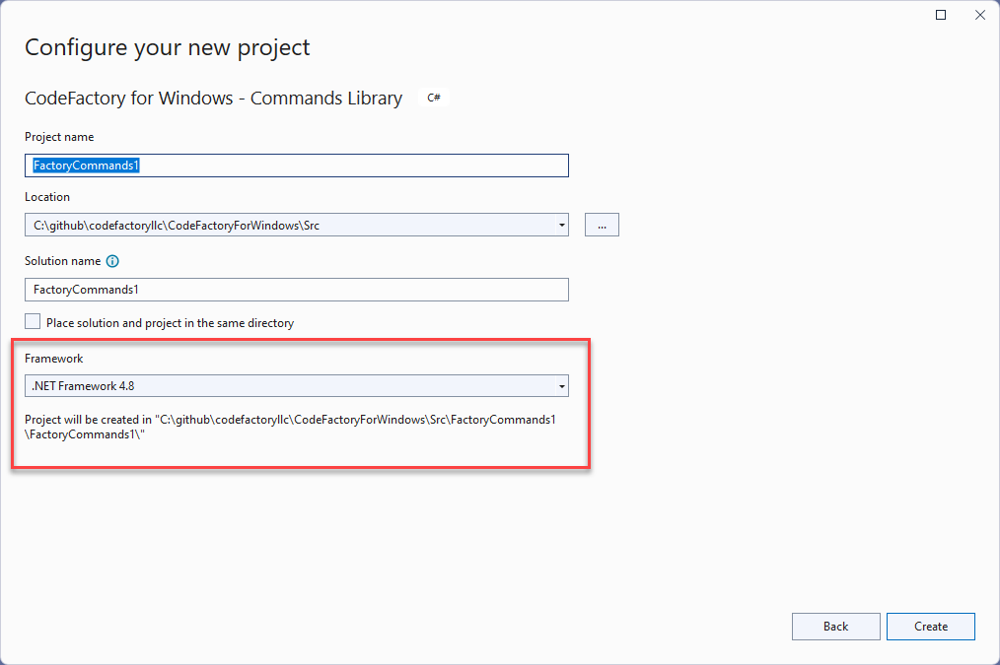
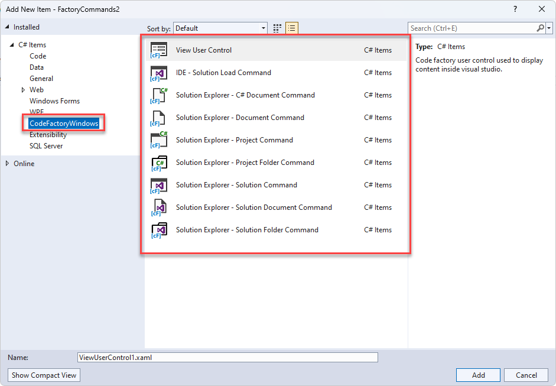

# CodeFactory SDK for Visual Studio for Windows

This project hosts the full SDK that is used by CodeFactory for Windows. 

## Overview
This repository is the offical home of version 2.0 of CodeFactory. 
The reason for the change is future planning for the usage of CodeFactory. 
In the future CodeFactory will run on multiple IDE environments.
Right now we are focusing on VisualStudio for Windows.

The following are some future IDE's we are investing for integration.
- **Microsoft Visual Studio Code**
- **Jet Brains Rider**

## SDK Libraries
The following are the new libraries and utilties that are used for building CodeFactory automation.

### CodeFactory.dll
This is the core contracts used by all version's of CodeFactory regardless of IDE. This has been ported to **.Net Standard 2.0**.

### CodeFactory.WinVs.dll
This is the entire implementation of the SDK related to Visual Studio for Windows. This contains a streamlined SDK over the version 1.0 of CodeFactory. 
The SDK has been ported to **.Net Standard 2.0**.

### CodeFactory.WinVs.Wpf.dll
This is the user interface controls library for Visual Studio for Windows this hostes the view control.
The SDK has been upgraded to **.Net Framework 4.8** requirement of Visual Studio for Windows.

### CodeFactory.Packager.WinVs.exe
The packager is a command line utility that packages up CodeFactory automation. 
This utility is automatically called after the build of a CodeFactory library.
The packager has been upgraded to **.Net Framework 4.8**.

## Updated Templates
The following outlines the new templates when authoring automation with CodeFactory. 
Since both version 1 and 2 of CodeFactory can run side by side, templates have been updated.

### CodeFactory for Windows - Command Library
The command library is the core library project used for creation of automation. 
nlike version 1.0 version there is a single library type now and no default folder structure.

When adding a new project you will select the **CodeFactory for Windows - CommandLibrary** project.

Important note its now a requirement to use **.Net Framework 4.8** when creating a command library.

### CodeFactory Command Templates
The solution explorer and IDE commands are still still avaliable in CodeFactory for Windows. 

They are now accessible under the category of **CodeFactoryWindows**.

#### User Control Change
The **VsUserControl** has been replaces with the **ViewUserControl**. 

This includes the following changes.
- Have changed the title property to just **Title**

Future changes coming soon.
 - Integration of Visual Studio themes.

#### Removal of T4
The **T4** functionality has been removed in version 2.0. The **SourceFormatter** replaces the needs for T4.
