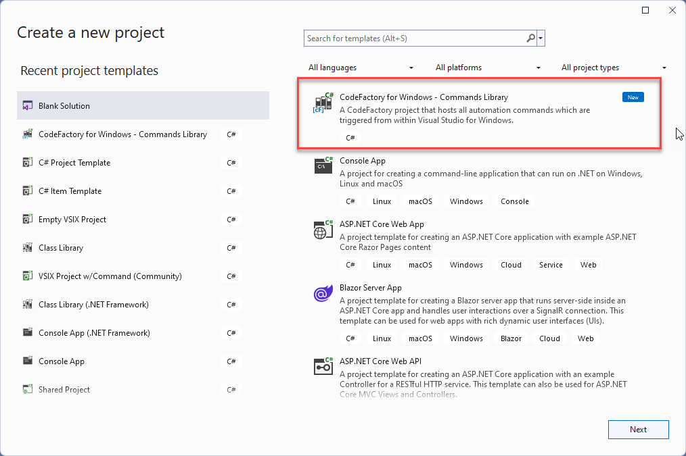
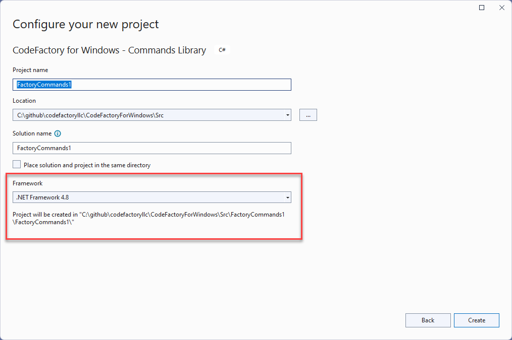
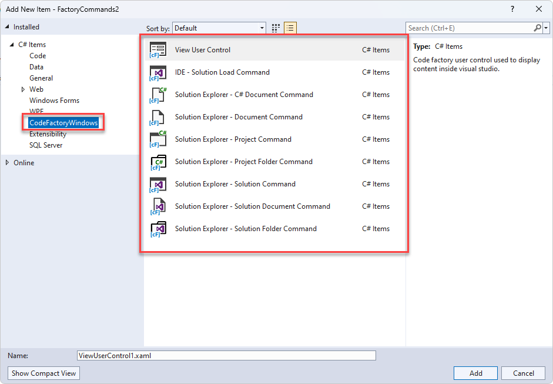

<a class="brand" >
 
Getting Started with CodeFactory for Visual Studio Windows
</a>

This documentation is currently in preview and will be updated incrementally closer to final release.

## Creating a Project

The command library is the core library project used for creation of automation. 
Unlike version 1.0 version there is a single library type now and no default folder structure.

When adding a new project you will select the **CodeFactory for Windows - CommandLibrary** project.

Important note its now a requirement to use **.Net Framework 4.8** when creating a command library.

## CodeFactory Command Templates
The solution explorer and IDE commands are still still avaliable in CodeFactory for Windows. 

They are now accessible under the category of **CodeFactoryWindows**.

#### User Control Change
The **VsUserControl** has been replaces with the **ViewUserControl**. 

This includes the following changes.
- Have changed the title property to just **Title**

Future changes coming soon.
 - Integration of Visual Studio themes.

#### Removal of T4
The **T4** functionality has been removed in version 2.0. The **SourceFormatter** replaces the needs for T4.